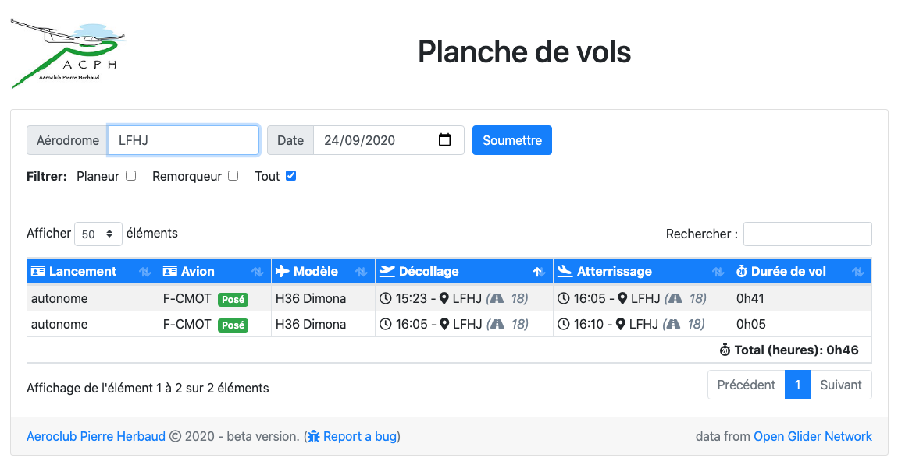
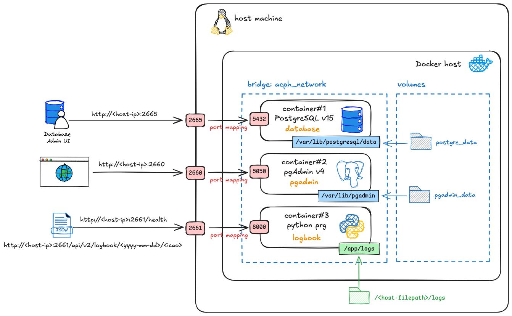

# PyAcphFlightsLogbook

 

Python-based flight logbook for **gliders** that automates the detection of takeoff and landing events, including airfield and schedule, by analyzing APRS traffic from the [Open Glider Network](http://wiki.glidernet.org/). The program tracks events at the aircraft level, enabling detection of takeoffs and landings at different airfields. Detected takeoff and landing times are approximate, with an accuracy of 1 to 2 minutes.

This project is a work in progress. In addition to takeoff and landing detection, the tool identifies the launch method (aerotow, self-launch, or winch launch) and, for aerotows, determines the tow plane. It also calculates flight duration.

Main features:

* Detection of take-off and landing time
* Flight duration calculation
* Launch method (tow plane, winch or autonome) detection
* Identification of the tow plane
* Detection of the runway used for tak-eoff & landing

Future releases could have additional features :

* Outlanding detection and location
* Other REST APIs
* ...

## Online demo

You can have a look to the implementation we did at [ACPH](https://aeroclub-issoire.fr) with a specific front-end develop for our website. There is also a REST API available to retrieve logbook for a specific date & airfield. To date processing of APRS aircraft beacons are limited to 400km around LFHA, so there is a chance that you don't see any data for your airport. :confused:

* [Responsive web front-end](https://aeroclub-issoire.fr/logbook/)
* [REST API (example to get the LFHA logbook on August 29th, 2020)](https://api.acph.synology.me:5001/api/v2/logbook/2020-08-29/LFHA)



### ACPH REST API endpoints reference

| Resource | Base route | Preferred method | Description  |
| --- | --- | --- | --- |
| `/logbook/<date>/<icao>` | `/api/v2` | GET | Retrieve the logbook of the day `date` for the airfield identified by it's `icao` code. |
| `/health` | | GET | Ping the server.  |

``` bash
# Example: retrieve the logbook for LFHA on August 29th, 2020
curl https://api.acph.synology.me:5001/api/v2/logbook/2020-08-29/LFHA
```

## Configuration

The program uses a configuration file to initialize settings related to database connection, logging behavior, APRS connection & filtering and other general settings.

The section `[logbook]` is used to initialize general parameters for the logbook

``` ini
[logbook]
; OGN devices database source: could be local or remote
ognddb = local
; Airport codes database source: could be local or remote
acdb = local
; persistence could be MySQL or JSON or PostgreSQL
persistence = MySQL
; number of days we keep logbook entry in the database
purge = 30
```

The section `[aprs]` is used to initialize  parameters related to APRS server connection and APRS messages filtering

``` ini
[aprs]
user = <aprs user>
passcode = <aprs passcode>
# any valid APRS filter like r/45.5138/3.2661/200, see http://www.aprs-is.net/javAPRSFilter.aspx
filter = <aprs filter>
```

The section `[database]` is used to initialize parameters for database connection

``` ini
[database]
database = <database-name>
user = <user>
password = <password>
host = <ip adress or dns name>
```

Sections for logging configuration are the standard ones of python logger package (see [logging.config](https://docs.python.org/3/library/logging.config.html) python documentation for more information). The default configuration logs messages up to INFO level in the log file `./logs/acph-aprs.log'` and message up to WARNING level on a slack channel (using webhook Slack API).

``` ini
...
[handlers]
keys=fileHandler,slackHandler

[handler_fileHandler]
class=FileHandler
level=INFO
formatter=acphFormatter
args=('./logs/acph-aprs.log',)

[handler_slackHandler]
class=slack_logger.SlackHandler
level=WARNING
formatter=acphSlackFormatter
args=('Put your webhook URL here',)
...
```

## Requirements

* pyhton 3.9

## How to run it locally with python3

We suggest you to create a virtual environment for running this app with Python 3. Clone this repository and open your terminal/command prompt in a folder.

```bash
git clone https://github.com/tfraudet/PyAcphFlightsLogbook.git
cd ./PyAcphFlightsLogbook
python3 -m venv .venv
```

On Unix systems

```bash
source .venv/bin/activate
```

On Window systems

```bash
.venv\scripts\activate
```

Install the requirements

```bash
pip install -r requirements.txt
```

### Setup the MySql database

By default the program use a MySql database to store the results. Assuming you have already a MySql database running, run the script ```setup_db.py``` to initialize the required tables. This need to be done only once when the database structure evolved or to create tables. The script uses ```acph-logbook.ini``` configuration file to get database connection parameters

```bash
python3 ./setup_db.py
```

### Usage

Executing the logbook python program is straight forward. It supports 2 arguments that are optionals.

``` bash
# execute the tool with default config file ./acph-logbook.ini
python3 acph-logbook.py

# or with a specific config file
python3 acph-logbook.py -i path-to-my-config-file.ini
```

Example to get the help

``` bash
# get the help
python3 acph-logbook.py -h

#this will return the following output
usage: acph-logbook.py [-h] [-i CONFIG_FILE]

ACPH Glider flight logbook daemon

optional arguments:
  -h, --help            show this help message and exit
  -i CONFIG_FILE, --ini CONFIG_FILE path to the ini config file, default value is ./acph-logbook.ini
```

You can run the API server directly with Flask for development purposes. The default configuration file for the API server is `api-server.ini`, where you can set up database access and logging configurations.

```bash
flask --app api_server run
```

Or using gunicron

```bash
gunicorn --bind='127.0.0.1:8000' --bind='[::1]:8000' -w 1 --threads 2 'api_server:app'
```

## How to run it locally using docker compose

`docker-compose.yml` configuration file allows you to easily spin up all the necessary services with a single command, providing an isolated and consistent environment for running locally on our machine and test your changes.

The services are:

* a PostgreSQL database
* pgAdmin, a tool to administrate PostgreSQL databases
* a python API server exposing glider fligths detected
* the Python logbook program

<div style="text-align: center;">
  <span><em>Application architecture overview.</em></span>
  
</div>

### Setup the environement

1. **Ensure Docker and Docker Compose are installed** on your local machine. You can find installation instructions for your operating system on the official Docker website.
2. **Navigate to the root directory of your project** in your terminal.
3. **Run the following command to start all the services:**

    ```bash
    docker compose -f docker-compose.yml up --detach

    # or to build images 
    docker compose -f docker-compose.yml up --build --detach
    ```

    The `--detach` flag runs the containers in detached mode (in the background).
4. **Once the containers are running**, you can access your application and its dependencies as defined in the `docker-compose.yml` file (e.g., via specific ports).
5. **To stop all the running services**, use the following command:

    ```bash
    docker compose down
    ```

### Access pgAdmin

* Open your browser and navigate to:[http://localhost:2660](http://localhost:2660)
* Login with:
  * Email: ```${PGADMIN_EMAIL}```
  * Password: ```${PGADMIN_PASSWORD}```

* And  Connect to the PostgreSQL in pgAdmin:
  * Add a new server in pgAdmin
  * Name: ACPH PostgreSQL
  * Connection details:
    * Host: database
    * Port: 5432
    * Database: ```${DB_NAME}```
    * Username: ```${DB_USER}```
    * Password: ```${DB_PASSWORD}```

### Access log files

To monitor the log files of python programs:

```bash
# the logbook log file
tail -f ./logs/acph-aprs.log

# the API server log file
tail -f ./logs/api-server.log

# or both
tail -f -v ./logs/acph-aprs.log ./logs/api-server.log
```

## Working principles

* process in realtime OGN APRS messages
* for each aircraft detect events like take-off and landing and store them in a database
* keep 30 days of retention in the database
* rely on the following open data resources
  * The [OGN devices database](http://ddb.glidernet.org/) from [OpenGliderNetwork](http://wiki.glidernet.org/) to identify any FLARM/OGN-equiped aircraft (type, model,...)
  * The [Airport codes & runway  database](https://ourairports.com/data/) from [OurAirports](https://ourairports.com/) to identify take-off and landing airfields

## Contributing

> Pending: :confused: to do!
